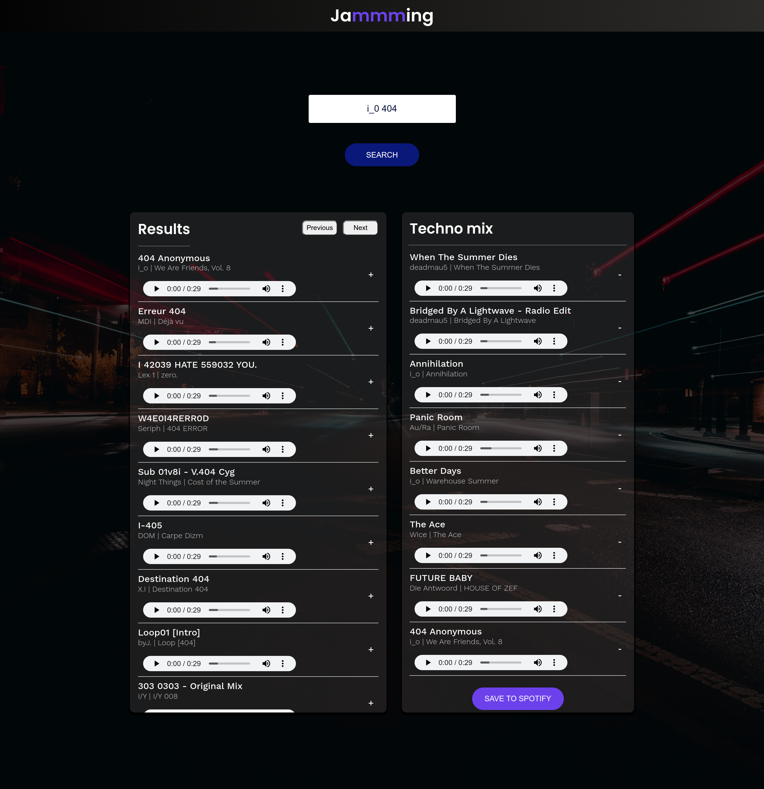
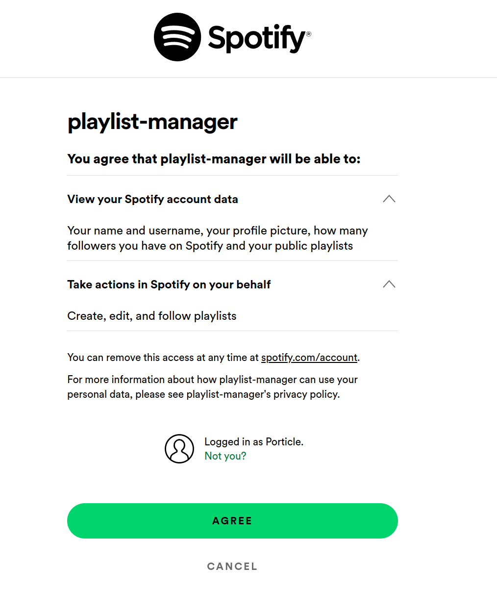

# Spotify playlist manager 

[Click here to go to the live app.](https://playlist-manager-omega.vercel.app/)

## What is it?
This React application links directly to your Spotify account and allows you to search through the entire Spotify music library, discover new songs, create new playlists and save those playlists to your account.

## How to use the application
[Click here to go to the app](https://playlist-manager-omega.vercel.app/). Once you're there, you will be redirected to a Spotify page where you will have to authorise this app to enable it to add new playlists to your account (see below for a screenshot). Don't worry, the app doesn't have access to any of your private information, just the public stuff.

## Application features
- This app makes GET and POST requests to the Spotify web API using temporary access tokens.
- Written using class components.
- The interface allows you to cycle back and forth between different pages as well as add and remove songs to your playlist.
- Give your new playlist a name by typing into the input box at the top of the playlist section.

## Screenshot

## Authorisation message

